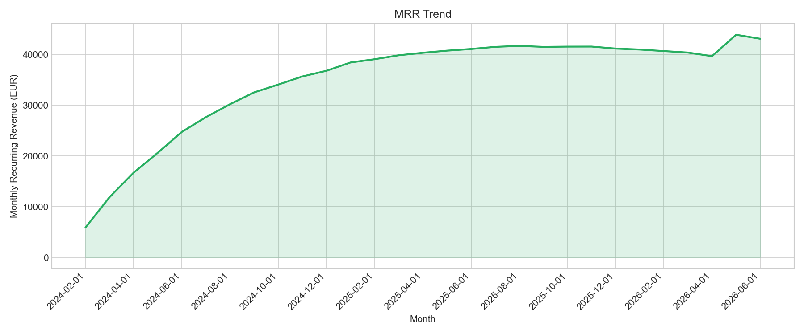
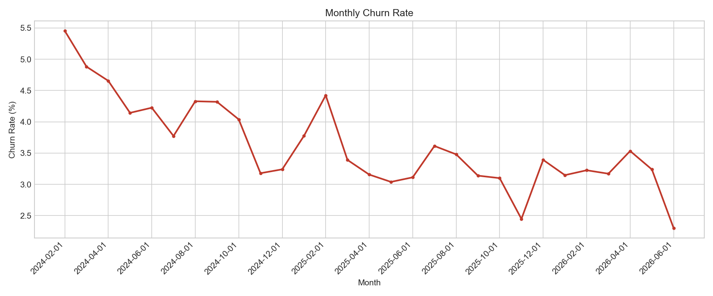
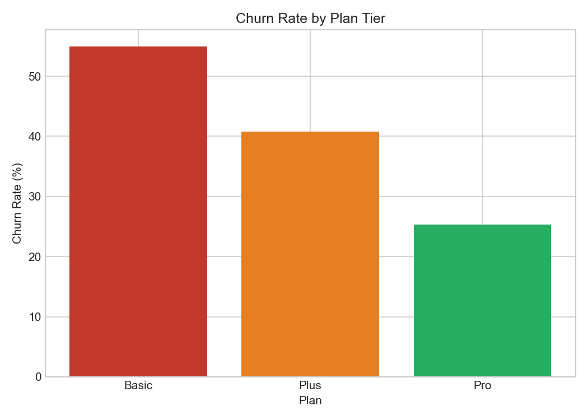
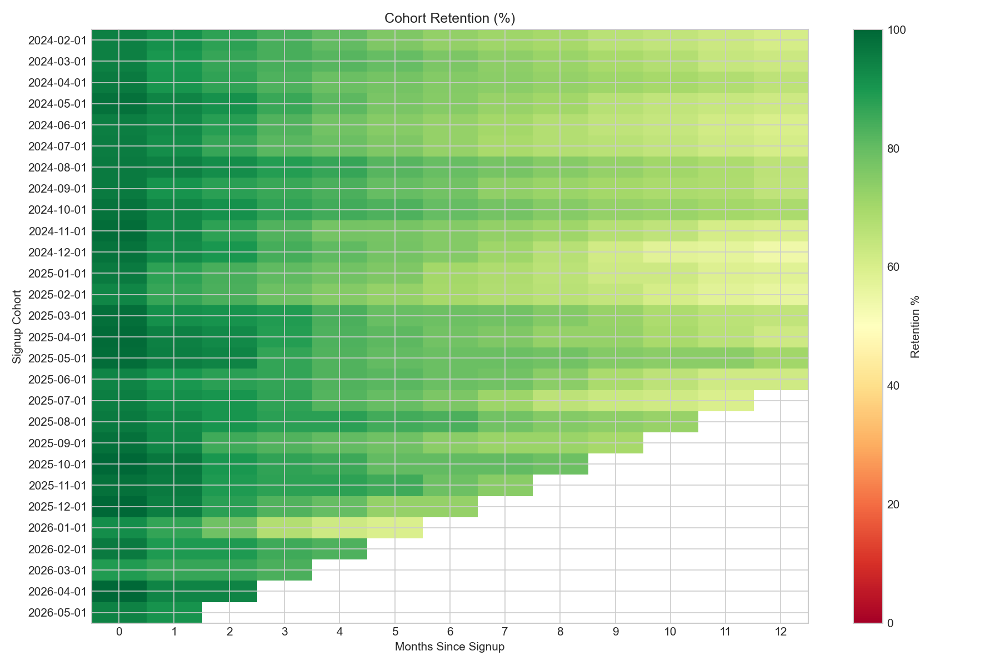

# Subscription Revenue & Churn Analytics

Cohort-based retention, MRR, and churn analysis for a subscription business -- built entirely with SQL and Python.

## Overview

This project analyzes 60,000 subscription customers and 1.5M+ billing events across 5.5 years to answer the core SaaS analyst questions: how is revenue trending, who is churning, and which cohorts/plans retain best?

## Key Findings

- MRR trend shows revenue trajectory across the full customer base over time
- Churn varies sharply by plan tier -- Basic plan customers churn at ~55%, compared to ~25% for Pro -- a clear signal that plan value/stickiness differs by tier
- Cohort retention curves show how each signup month's customers retain over their first N months, the standard SaaS retention view
- Monthly churn rate tracks the rate of customer loss month over month, useful for spotting seasonal or campaign-driven spikes

## Charts

## Project Structure

    data/          customers.csv, billing_events.csv, generate_data.py
    sql/           MRR, churn, cohort retention (multi-CTE), load_db.py, run_all_queries.py, make_charts.py
    outputs/       query result CSVs + chart images (outputs/charts/)

## How to Run

    python3 sql/load_db.py
    python3 sql/run_all_queries.py
    python3 sql/make_charts.py

## Methodology Notes

Cohort retention groups customers by signup month, then tracks what percentage of each cohort remains active N months later -- computed via a multi-step CTE joining billing activity back to cohort membership. Churn rate is calculated per month as churned customers divided by active customers at the start of that month. Churn hazard varies by plan tier and decreases with customer tenure (longer-tenured customers are stickier); signups follow a growth-then-maturity curve over the business's history.

## Tech Stack

SQL (SQLite, window functions, CTEs) - Python (Pandas, NumPy) - Power BI - Excel
